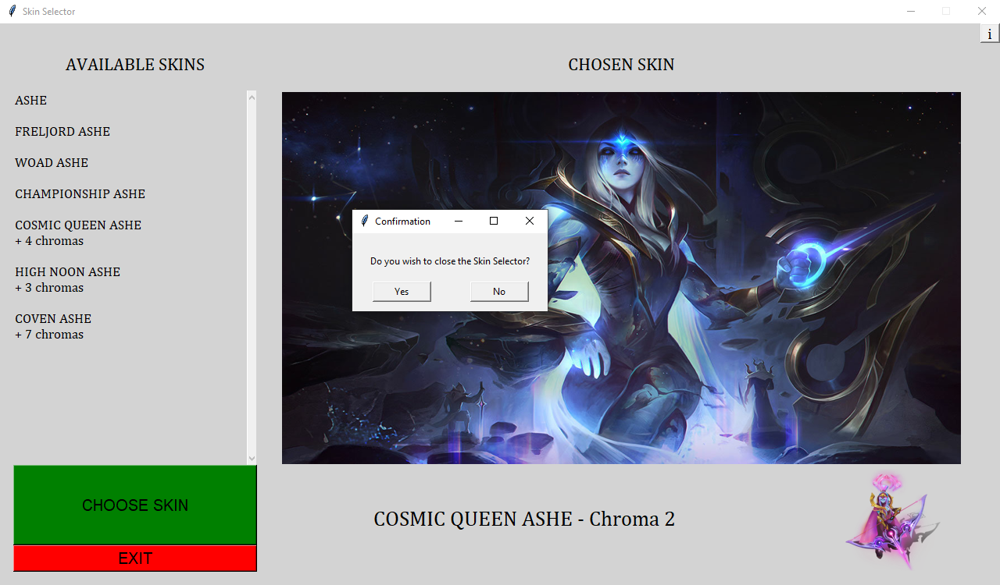

# SkinSelector

SkinSelector is a Python3 program, with Tkinter for the GUI, to choose the skin for the player among the ones they have available.

If the player has several skins and does not want to choose which one to use, this simple application randomly selects one of them,
chroma included. Furthermore, it lists every skin of the champion currently locked in the player owns and how many chromas for each skin,
working as a reminder of their collection.

## Libraries
**numpy** 1.24.1

**psutil** 5.9.4

**requests** 2.28.1

**certifi** 2022.12.07

**PIL** 9.3.0

**Tkinter** 8.6

## Using the program
While having League of Legends open, run the program and click on Start to establish a connection with the client.

In the champion select screen, with the champion already locked in, click on "CHOOSE SKIN". The button does nothing if
no champion is locked in. The first time may take a few more seconds.

## How it works
The program posts a request to the client for all the skins the currently locked in champion has.
Then, it filters for only the unlocked skins and chromas.
Next, it randomly chooses one of them, with all having the same probability.
With the skin chosen, its splash art is downloaded from Data Dragon to be displayed.

Finally, the splash art is displayed on the main area of the window.
Below, it's the area for the name of the skin and the chroma selected if applicable as well as a preview of the chroma.
On the left side, there is a list with every skin available and the number of chromas for the respective skin for that champion.

Since the splash art is downloaded from Data Dragon after being chosen, the program itself is very light.
However, it takes a couple seconds for the result to be rendered and depends on the user's internet speed.

Skin and chroma selected.

Skin without chroma selected.

## Closing the program
The program can be directly closed via the close button on the window.
If the user use the EXIT button, a confirmation window appears before closing both windows.

Closing the program.

## Endorsement

*SkinSelector isn't endorsed by Riot Games and doesn't reflect the views or opinions of Riot Games or anyone officially involved in producing or managing Riot Games properties. Riot Games, and all associated properties are trademarks or registered trademarks of Riot Games, Inc.*
